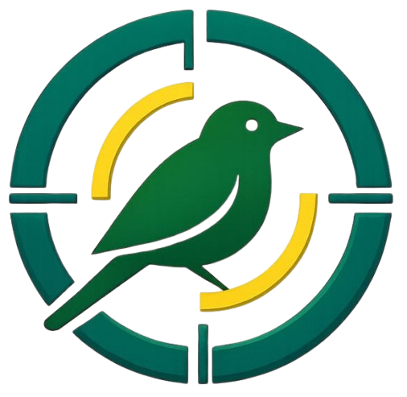

# 🦉 BirdScope — Platform of Avian Conservation and AI Recognition

<div align="center">
  
  <p><strong>Explore, identify, and help conserve the breathtaking bird species of Tolima, Colombia.</strong></p>
</div>

---

## 🌿 About BirdScope

**BirdScope** is a state-of-the-art, premium frontend application designed for avian enthusiasts, biologists, and conservationists. Centered on the rich biodiversity of the Tolima department in Colombia, the platform combines a gorgeous, immersive aesthetic with modular tech components to deliver an unforgettable user experience. 

Through standard web and PWA-ready features, users can catalog regional species, browse local conservation efforts, and harness cutting-edge **Computer Vision AI** to scan and identify birds instantly in the field.

---

## ✨ Features & Project Pillars

### 📲 Immersive User Flow
* **🔒 Premium Portal Access:** Seamless, beautifully styled login screen featuring dynamic brand integration and custom modern input controls.
* **🏠 Interactive Dashboard:** Immersive, high-contrast hero section with responsive high-resolution forest viewport backdrops, tailored to HD screens and mobile devices alike.
* **🎯 IA Bird Scanner:** Visual recognition modules prepared to consume image files and camera streams to instantly identify birds using custom targeting reticles.
* **🌳 Conservation Initiatives:** Immersive routes showcasing regional micro-habitats, environmental reports, and local conservation programs.
* **📚 Species Dictionary:** Seamless and lightweight cards displaying data on emblematic birds such as the *Andean Condor*, *Loro Orejiamarillo*, and the *Colibrí*.

---

## 🛠️ Technology Stack

* **Core Platform:** [Angular](https://angular.io/) (v16+) & [Ionic Framework](https://ionicframework.com/) for a modular, lightning-fast component lifecycle and mobile-first gesture support.
* **Styling & Layout:** [Tailwind CSS](https://tailwindcss.com/) for utility-first responsive layout structures coupled with **Custom SCSS** using SASS variables for high-fidelity component encapsulation.
* **Iconography:** [Iconify Icon System](https://iconify.design/) powered by Lucide icons for ultra-lightweight SVG vector scaling.
* **Package Management:** Optimized for [Bun](https://bun.sh/) & [NPM](https://www.npmjs.com/).

---

## 📐 Architecture & Premium Layout Highlights

* **🛸 Smart Transversal Header (`<app-header>`):** 
  * A single, reactive component that governs the entire site navigation globally.
  * Listen to router events (`NavigationEnd`) to hide automatically on `/login`.
  * **Dynamic states:** Renders fully transparent when overlying pages with hero banners (Home, Conservación), and transforms into a luxury solid forest header with a deep green overlay (`#1c261e` at 85% opacity), background-blur effects (`backdrop-blur-[2px]`), and a custom high-definition woodland backdrop (`bosque.png`) on solid pages.
* **📂 Strict Separation of Concerns:** 
  * Reusable templates, clean TS controllers, and modular styles where classes are cleanly nested inside `.scss` files using `@apply` and standard SASS rules.
* **📱 Adaptive Viewport Offsets:**
  * Configured globally in `app.component.html` using a dynamic content wrapper that responds to page transparency, preventing Ionic absolute containers from overlapping behind the global header.

---

## 📁 Workspace Directory Structure

```bash
BirdScopeFront/
├── src/
│   ├── app/
│   │   ├── shared/                # Globally reusable modular components
│   │   │   └── components/
│   │   │       └── header/        # Universal navigation header
│   │   ├── home/                  # Landing page & Hero banner
│   │   ├── login/                 # Immersive authentication page
│   │   ├── especies/              # Avian database interface
│   │   ├── conservacion/          # Environmental resources & ecological studies
│   │   ├── reconocimiento/        # AI Camera Scanning interface
│   │   ├── acerca/                # Project history & corporate values
│   │   ├── app.component.html     # Application root layout with dynamic offset wrapper
│   │   └── app-routing.module.ts  # Lazy-loaded route configurations
│   ├── assets/
│   │   ├── icon/                  # Application icons & Favicons
│   │   └── images/                # HD Photography assets (bosque.png, colibri.png, etc.)
│   └── global.scss                # Global styles, typography & CSS variables
├── tailwind.config.js             # Custom colors, fonts & spacing definitions
└── angular.json                   # Build & assets configuration schemas
```

---

## 🚀 Getting Started

### 📋 Prerequisites
Ensure you have the following installed on your local environment:
* [Node.js](https://nodejs.org/) (v18+)
* [Bun](https://bun.sh/) (recommended for fast execution) or NPM

### 1️⃣ Install Dependencies
Clone the repository, navigate to the folder, and run:
```bash
bun install
# or
npm install
```

### 2️⃣ Run the Development Server
Launch the local Hot Reload compiler:
```bash
bun start
# or
npm run start
```
Open your browser and navigate to `http://localhost:8100` to preview the premium web layout!

### 3️⃣ Build for Production
To generate a fully compiled, minified, and production-ready build:
```bash
bun run build
# or
npm run build
```
The optimized bundle will be available in the `www/` directory, ready to be deployed to static hosting providers or wrapped in mobile containers via Capacitor.

---

<div align="center">
  <p>Developed with 💚 for the unique birds of Colombia.</p>
</div>
